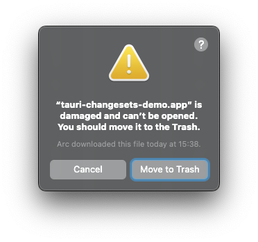

# Tauri Changesets Demo

Based on [minimal Tauri v2 demo](https://github.com/sitek94/tauri-minimal-demo) a simple demo with
releases managed by [changesets](https://github.com/changesets/changesets)

- On each push to main branch scans for changesets and creates a release if there are any
- Creates a Release PR with the new version
- After merging the release PR, the release is published to GitHub Releases with new app binaries
- App automatically checks for updates from GitHub Releases

> **Note** This demo is currently set up for Apple Silicon Macs (M1 and above) only. If you want to
> use a different architecture, you'll need to modify the GitHub Actions workflows.

## Prerequisites

- [Bun](https://bun.sh/) - although you can use whatever you want, just remember to update all
  commands and GitHub actions

## Setup

In order for this setup to work, you need to have a few things set up:

1. Install dependencies:

   ```bash
   bun install
   ```

2. Rename every occurrence of `tauri-changesets-demo` to your app name

3. Generate a signing key for your app, e.g. using tauri signer

   ```bash
   bunx tauri signer generate -w ~/.tauri/tauri-demo.key
   ```

4. Update `plugins.updater.pubkey` in `tauri.conf.json` with the public key

5. Set up required secrets in GitHub repo settings:
   - `RELEASE_GITHUB_TOKEN` - token with `repo` and `workflow` scopes (if like me you want to use a
     bot account for release remember to invite it to the repo first)
   - `TAURI_SIGNING_PRIVATE_KEY` - private key generated in step 2
   - `TAURI_SIGNING_PRIVATE_KEY_PASSWORD` - password for the private key

## Release

1. Edit code
2. Run `bun changeset` and describe your changes
3. Push your changes
4. After your changes are pushed to the main branch, a release PR will be created
5. After merging the PR, the release will be published to GitHub Releases with new app binaries

## FAQ

### macOS app is damaged

If it's first time you install the app on mac, you might see this:



To fix this, you need to run this command:

```bash
xattr -d com.apple.quarantine /Applications/tauri-changesets-demo.app # or your app name
```

You need to run this command only once, because afterwards the app updates itself automatically.

## Preview


## Bootstrapped with Tauri v2

- [Tauri 2.0](https://tauri.app/)
